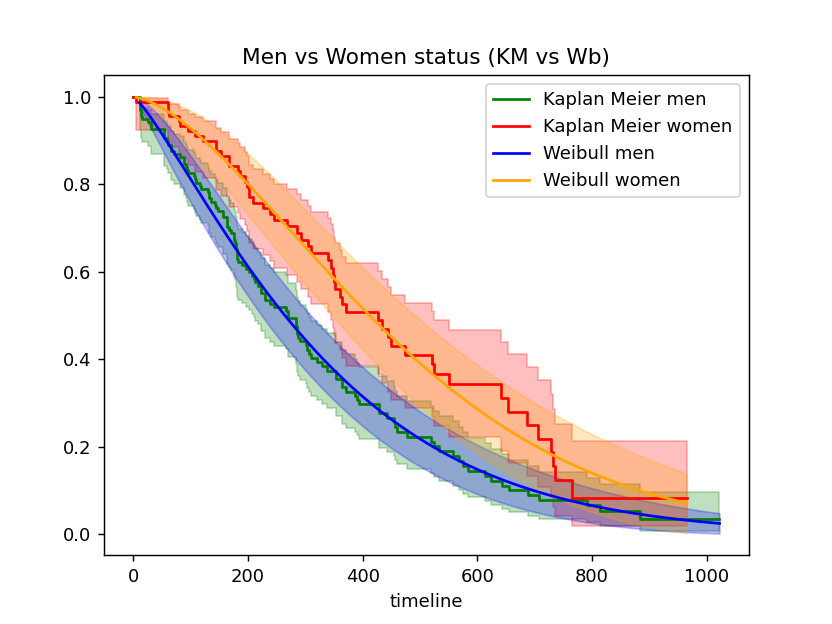
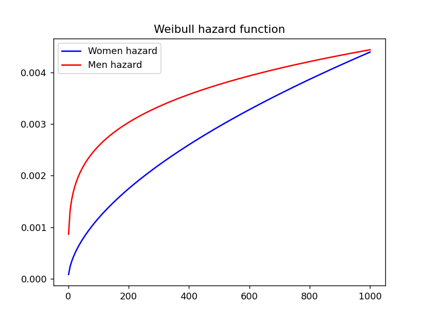
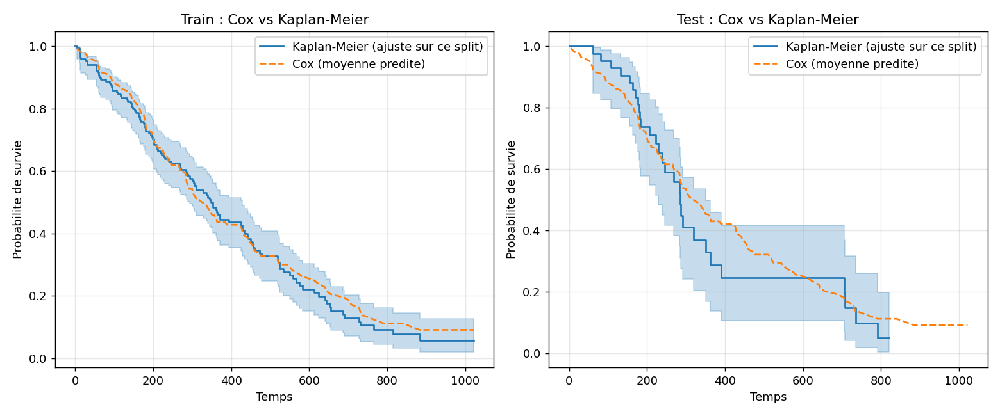
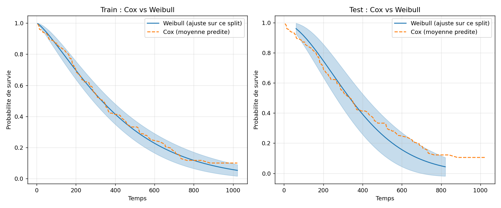

# Survival Analysis API — Production ML System

Production-ready Machine Learning API for survival analysis using Kaplan-Meier and Weibull models.

The system is deployed in production and exposes a fully documented REST API.

---

## Overview

This project implements a full machine learning pipeline for survival analysis and exposes it as a production-ready REST API.

It combines statistical modeling, backend engineering, and cloud deployment.

---

## Key Features

- Survival analysis models:
  - Kaplan-Meier estimator (non-parametric)
  - Weibull survival model (parametric)
- REST API built with FastAPI
- Input validation using Pydantic
- Automated testing with pytest
- CI/CD pipeline using GitHub Actions
- Dockerized deployment
- Cloud deployment (Render)

---

## Skills Demonstrated

- Machine Learning: survival analysis, probabilistic modeling
- Backend Engineering: FastAPI REST API design
- MLOps: Docker, CI/CD, cloud deployment
- Software Engineering: modular architecture, testing, API design

---

## API Endpoints

- GET `/health`
- GET `/docs`
- POST `/survival_KM`
- POST `/survival_Weibull`

---

## Design Decisions

**Why FastAPI ?**

FastAPI was chosen for its high performance, native support for asynchronous operations, and automatic generation of OpenAPI/Swagger documentation, which simplifies API testing and integration.

**Why Kaplan-Meier ?**

The Kaplan-Meier estimator is a non-parametric method that provides a robust baseline for survival probability estimation without assuming any specific distribution.

**Why Weibull Model ?**

The Weibull model introduces a parametric approach capable of capturing varying hazard rates over time, making it suitable for modeling more structured time-to-event behaviors.





Weibull Women Results involve that shape parameter (p = 1.57) are significantly different from 1 (p-value <0.005 for rho/lambda for women and z = 3.34). 

This indicates that the hazard function is NOT constant over time. The positive deviation from 1 suggests an increasing failure rate." 
This is coherent with a deterioration process. 

Meanwhile, Weibull men results involve that lambda is statistically significant, indicating a well-defined survival time scale.
Whereas, the shape parameter rho is not significantly different from the reference value, suggesting insufficient proof for an increasing deterioration (p < 0.1).
This could means that the mortality risk for men is approximately constant over time, or that the dataset lacks power to detect time variation.


**Notable technique points**

- Under/overfitting diagnostics via train/test C-index
- SQL queries using CASE WHEN, aggregate functions, HAVING, and window functions (RANK() OVER (PARTITION BY ...), NTILE()) for cohort segmentation and risk ranking (see app/database/queries/)
- Interactive Power BI dashboard with cross-filtering and conditional formatting (see ./Power Bi Board/PowerBi_survival_analysis.gif)
- Model comparison: Kaplan-Meier (non-parametric baseline) vs Weibull (parametric) vs Cox PH (covariate-based), with visual validation of each model's fit against empirical survival curves on both train and test splits





The Cox proportional hazards model was fitted on 170 patients, including 122 observed events and 48 censored observations.

**Sex** was the strongest prognostic factor (HR = 0.53, p < 0.001). According to the dataset coding (1 = male, 2 = female), women exhibited approximately 47% lower instantaneous mortality risk than men.
**ECOG** performance status significantly increased mortality (HR = 1.57, p < 0.001), meaning that each additional ECOG point increased the hazard by approximately 57%.
**Age** had a smaller but significant effect (HR = 1.03, p = 0.02), corresponding to an increase of roughly 3% in mortality risk per additional year.
**Weight** loss was not statistically significant (p = 0.20) after adjustment for the other variables.

These findings are consistent with the previous Kaplan–Meier and Weibull analyses. Women showed a substantially longer median survival (426 vs 270 days) and higher survival probability at 300 days (67.4% vs 44.1%), supporting the Cox model estimates.

The decrease from 0.659 (train) to 0.553 (test) suggests moderate overfitting, although the cross-validation score indicates acceptable stability across folds.

Finally, the proportional hazards assumption was assessed using Schoenfeld residuals. Only the variable sex showed a significant deviation (p = 0.028), suggesting that its effect may vary over time. Therefore, the estimated hazard ratio for sex should be interpreted as an average effect over the follow-up period. The proportional hazards assumption was satisfied for the remaining covariates.


**Why a separation between services / models / API layers**
The architecture follows a modular design to improve maintainability, scalability, and testability:
- `models/` handles statistical and ML logic
- `services/` encapsulates business logic and computations
- `api/` exposes clean REST endpoints via FastAPI

This separation ensures clear responsibilities and simplifies future extensions or model replacement.

---

#Go in your path

pip install -r requirements.txt
python -m app.database.seed

---

python -m app.main

---

uvicorn app.main:app --reload

---

Running tests:

pytest -v

---
Exporting SQL queries for Power BI:

python -m app.database.run_query

CSV files are written to app/database/outputs/, ready to import into Power BI.

---

Open Docker Desktop first, then, Docker build (image) and run (container):

docker build -t survival-analytics-platform -f docker/Dockerfile .

docker build --no-cache -t survival-analytics-platform -f docker/Dockerfile . #if you need to reinstall over depedencies !

docker run -p 8000:8000 survival-analytics-platform

---

## Example Request

### Python 

```python id="r2"
import requests

url = "https://survival-analytics-platform.onrender.com/survival_KM"

payload = {
    "sex": "female",
    "time": 300
}

response = requests.post(url, json=payload)

print(response.json())
```
## Power BI Dashboard

A preview of the interactive Power BI dashboard built on top of the SQL database used by the API.

./Power Bi Board/PowerBi_survival_analysis.gif

***Data source***

lifelines.datasets.load_lung — a public, anonymized lung cancer clinical dataset (North Central Cancer Treatment Group), distributed with the lifelines Python package.

## Author:

Léna Osu
Physics PhD → Statistical Modeling & Inference | Data Science | Self-Taught ML Engineer
GitHub: https://github.com/lenaosu
LinkedIn: https://linkedin.com/in/lena-osu-b532073a0